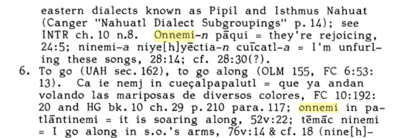

# ONNEMI-4211

My new software philosophy: 

    One Language
    No Config
    No Build
    Everything Is A Module
    Modules Are 150 Lines
    Imperative Is Best

And...

    Set wrap at 42 character width
    1:1 expressions and lines

That's **ONNEMI-4211**.

### O — One Language

- No CSS, HTML, macros, build flags, etc. Construct all assets, start all services, generate all build artifacts imperatively in the same language you are coding in.


### N — No Config

- Switches, addresses, hashes, application structure, all must be written in function calls, not keys in a config file.

- If you are using a Makefile, your whole application is written in make. If you have a Webpack config, your whole app is written inside it.

### N — No Build

- Can be started by compiling or running one file


###  E — Everything Is Module

- No dependencies implicit in filesystem, environment switches, build descriptors, etc. All libraries must be communicate with other libraries through formal interfaces in the language you are coding in


### M — Modules Are 150 Lines

- They’ll grow to 600 but they want to be 150


### I — Imperative Is Best

- Pass data to procedures. Don't enter namespaces. Don't pass flags.

- Try not to have keys on objects that stick around and affect different pieces of code at different times. As much as possible try to use objects in the same module that created them

### Wrap lines at 48 character width

### 1:1 — One expressions per line

- You may type [ some symbols (including var, function, etc), [ some identifierish possibly, and some separator symbols ], [ another identifierish or any string up to... ], some exit symbols ]

- Anything after that, like an identifierish followed by a (, is dropped to the next line and indented

- All block punctuation goes at the end of a line of code

That's **ONNEMI-4211**.


### Code sample

```javascript
library.define(
  "hello world",[
  "web-site",
  "web-element",
  "browser-bridge"],
  function(WebSite, element, BrowserBridge) {

    var site = new WebSite()

    site.start(
      3444)

    var page = element(
      "hello world")

    site.addRoute(
      "get",
      "/",
      function(_, response) {

        var bridge = new BrowserBridge()
          .forResponse(
            response)

        bridge.send(
          page)})
  })
```


### P.S.

When multiple blocks are nested and a the start of two closely nested scopes scrolls beyond the top of the screen, their closers are dropped down to their own line, indented to the deepest of the closers

### P.S.S.

Interesting coincidence, onnemi is a Nahuatl (pre-Aztec) word that means “He Lives!”



